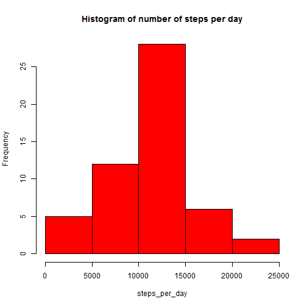
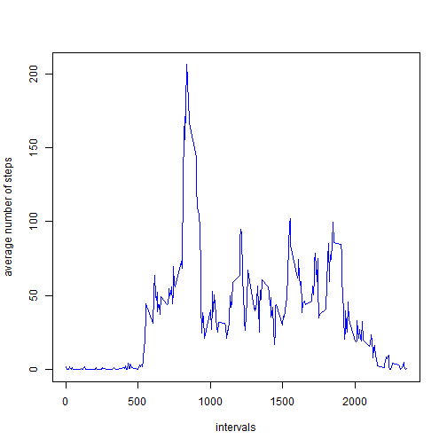
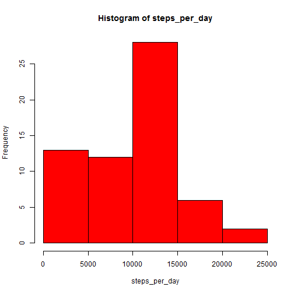
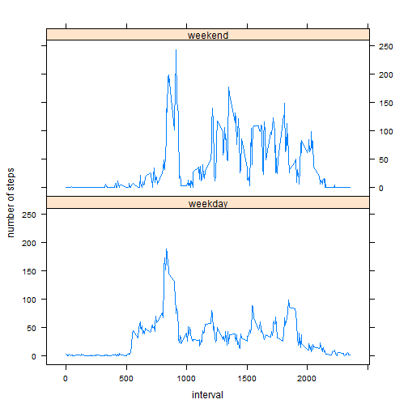

## Loading and preprocessing the data
In this part of the assignment, the raw data from the "activity.csv" file are read and stored in a dataset "d". Also, the format of the date column of the dataset is changed from "factor"" to "Date"

```r
# if the unzipped file does not exist, unzip the zip file
if(!file.exists("activity.csv")) unzip("activity.zip")
# read the raw data
d <- read.csv("activity.csv")
# change the format of the date comlumn from factor to Date
d$date <- as.Date(d$date)
```

## What is mean total number of steps taken per day?
First, the missing values are omitted from the dataset and the result is stored in "d2" dataset. Then, the unique values of the date column are stored in the variable "days". In the for loop sum of the steps taken per day is calculated and stored in the "steps_per_day" vector. This vector is then used to draw the histogram, and to calculate the mean and median.

```r
# ommit the rows with missing values
d2 <- subset(d, !is.na(d$steps))
# detect unique values of date column
days <- unique(d2$date)
# create a numeric vector
steps_per_day <- numeric()
# count the number of steps per day
for(i in 1:length(days)){
      steps_per_day[i] <- 
            sum(subset(d2, d2$date == days[i])$steps)
}
# draw the histogram and calculate the mean and median
hist(steps_per_day, col = "red", main = "Histogram of number of steps per day")
```

 

```r
mean(steps_per_day)
```

```
## [1] 10766.19
```

```r
median(steps_per_day)
```

```
## [1] 10765
```
Average number of steps per day was calculated at 10766, and the median of number of steps per day was calculated at 10765.

## What is the average daily activity pattern?
In order to draw the time series plot, it is needed to first calculate the average number of steps taken in each interval, across all days. To do so, unique values in the interval column are detected and stored in the variable "intervals". Then using a for loop the number of steps in each interval are counted regardless of the date. 


```r
# detect the unique values in the interval column
intervals <- unique(d2$interval)
# create a numeric vector to store the averages
avg_steps_per_interval <- numeric()
# going through the intervals vector, count the number of steps for each one
for(i in 1:length(intervals)){
      avg_steps_per_interval[i] <- 
            mean(subset(d2, d2$interval == intervals[i])$steps)
}
# draw the plot with intervals as the x-axis and the average number of taken steps as the y-axis
plot(intervals, avg_steps_per_interval, type = "l", col = "blue", lwd = 1, ylab = "average number of steps")
```

 

To find the maximum of average steps among the intervals, a dataframe object is created by combining the two vectors "intervals" and "avg_steps_per_interval" and then the wich.max() function is used to subset the maximum record from the dataframe.

```r
df <- data.frame(intervals, avg_steps_per_interval)
df[which.max(df$avg_steps_per_interval),]
```

```
##     intervals avg_steps_per_interval
## 104       835               206.1698
```
The interval 835 has the maximum average number of steps at 206.

## Imputing missing values
The number of missing values is calculated using the sum() function and is.na().

```r
sum(is.na(d$steps))
```

```
## [1] 2304
```
Total number of rows with missing values is 2304.  
The missing values are replaced with the median of that interval across all days. 

```r
# create a numeric vector to store the median for each interval
median_steps_per_interval <- numeric()
for(i in 1:length(intervals)){
      median_steps_per_interval[i] <- 
            median(subset(d2, d2$interval == intervals[i])$steps)
}
# create a dataframe by combining the "intervals"" vecotr and the "median_steps_per_interval"" vector
df2 <- data.frame(intervals, median_steps_per_interval)
# store the raw data in a new object d3
d3 <- d
# looping through all rows in the d3 dataset, replace the missing values with the corresponding value in the df2. This leads to a new dataset without missing values.
for(i in 1:length(d3$steps)){
      if(is.na(d3$steps[i])) d3$steps[i] <- 
                df2[intervals == d3$interval[i],]$median_steps_per_interval
}
# calculate the seps per day from the new d3 dataset
steps_per_day <- numeric()
days <- unique(d3$date)
for(i in 1:length(days)){
      steps_per_day[i] <- 
            sum(subset(d3, d3$date == days[i])$steps)
}
# draw the histogram and calculate the mean and median
hist(steps_per_day, col = "red")
```

 

```r
mean(steps_per_day)
```

```
## [1] 9503.869
```

```r
median(steps_per_day)
```

```
## [1] 10395
```

Average number of steps per day was calculated at 9503, and the median of number of steps per day was calculated at 10395. The estimated mean and median are different from the first part of the assignment, when the missing values were omitted. The replacement of the missing values (with the median of the interval across all days) resulted in lower mean and median for the total number of steps per day. Obviously, depending on the strategy implemented for filling the missing values, different results may be obtained.

## Are there differences in activity patterns between weekdays and weekends?
The function weekdays() is used to add a new factor variable with two levels ("weekday" and "weekend") to the d3 dataset. Then in order to compare the average steps per interval between weekdays and weekends a two separate sets of averages are calculated: "mean_steps_per_interval_weekdays" and "mean_steps_per_interval_weekends". After creating dataframes of these variables and susequently binding them together in the dataframe named "c", this dataframe is used in the xyplot() function to draw the graph. 

```r
library(lattice)
# add a new variable to the dataset and assign the weekend/weekday values using the weekdays() function
for(i in 1:length(d3$steps)){
      if(weekdays(d3$date[i]) == "Saturday" | 
         weekdays(d3$date[i]) == "Sonday") 
            d3$Weekday[i] <- "weekend"
      else d3$Weekday[i] <- "weekday"
}
# calculate the average steps per interval across weekdays
intervals <- unique(d3$interval)
mean_steps_per_interval_weekdays <- numeric()
for(i in 1:length(intervals)){
      mean_steps_per_interval_weekdays[i] <- 
            mean(subset(d3, 
                        d3$interval == intervals[i] &
                        d3$Weekday == "weekday")$steps)
}
# calculate the average steps per interval across weekends
mean_steps_per_interval_weekends <- numeric()
for(i in 1:length(intervals)){
      mean_steps_per_interval_weekends[i] <- 
            mean(subset(d3, 
                        d3$interval == intervals[i] &
                        d3$Weekday == "weekend")$steps)
}
a <- data.frame(intervals, mean_steps_per_interval_weekends, "weekend")
names(a) <- c("interval", "steps", "weekday")
b <- data.frame(intervals, mean_steps_per_interval_weekdays, "weekday")
names(b) <- c("interval", "steps", "weekday")
# bind the two dataframes a and b and use it to draw the plot
c <- rbind(b , a)
p <- xyplot(steps ~ interval | weekday, data = c, layout = c(1,2), type = "l", ylab = "number of steps")
print(p)
```

 

As is shown in the above graph, there is a significant difference between the activity patters on weekdays and weekends. On the weekends this person tends to be more active and more steps are taken throughout the day compared to the weekdays. 


